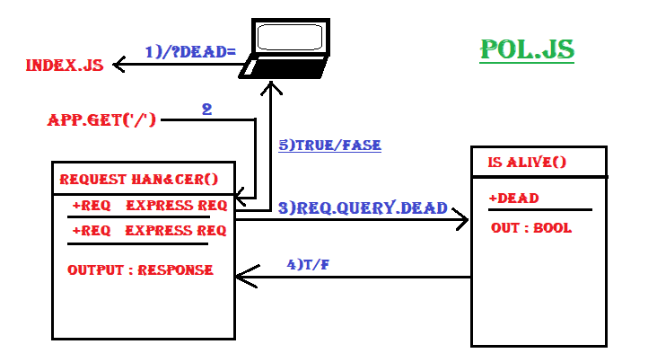

# LAB - 00

## Proof of Life Server

### Author: Ahmed Abu Samaan

### Links and Resources
* [submission PR](https://github.com/AhmedAbuSamaan-401-advanced-javascript/lab-00/pull/2)
* [travis](https://travis-ci.com/github/AhmedAbuSamaan-401-advanced-javascript/lab-00)
* [front-end](https://ahmedabusaaman-lab00.herokuapp.com/) 

#### Documentation
* [jsdoc](https://ahmedabusaaman-lab00.herokuapp.com/docs/) (Server assignments)

### Modules
#### `pos.js`
##### Exported Values and Methods

###### `isAlive(dead) -> boolean`
Returns true/false to indicate how the server works

### Setup
#### `.env` requirements
* `PORT` - Port Number

#### Running the app
* `npm start`
* Endpoint: `/`
  * Returns a boolean
* Endpoint: `/docs`
  * Returns a JSDoc Documentation Pages
  
#### Tests
* Unit Tests: `npm test`
* Lint Tests: `npm run lint`

Incomplete Tests:

- Every thing completed

#### UML

